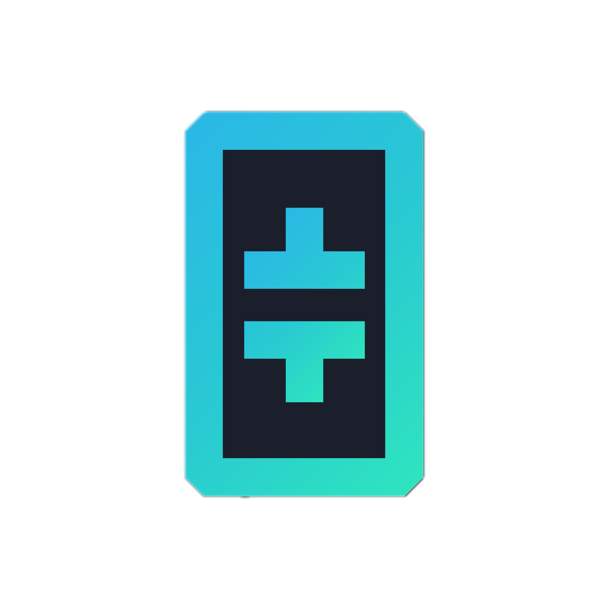
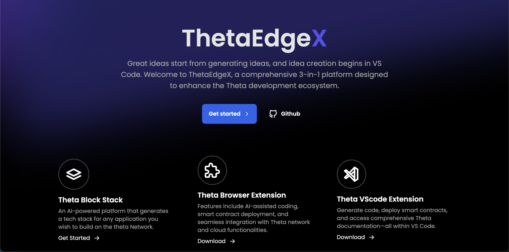
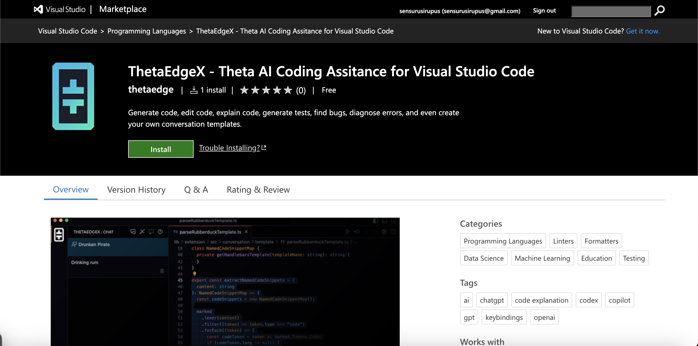
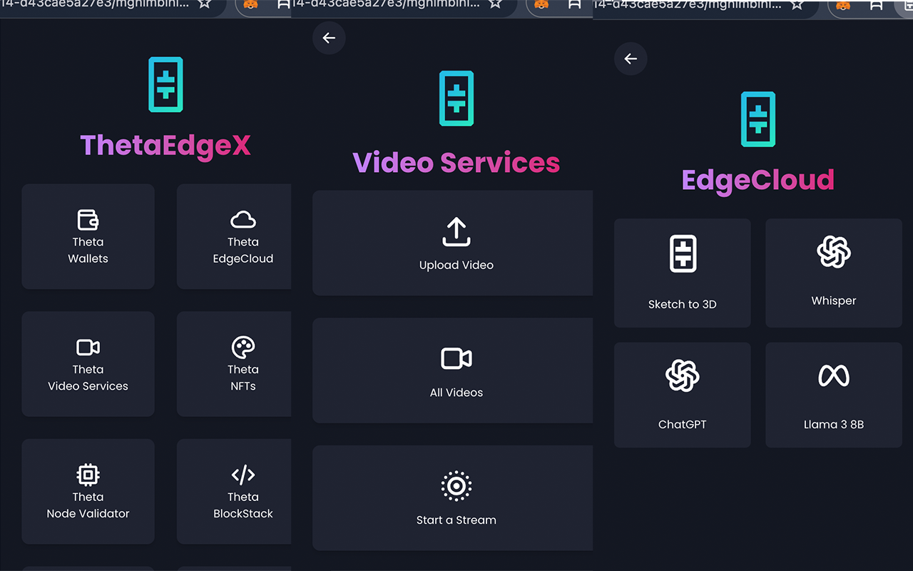
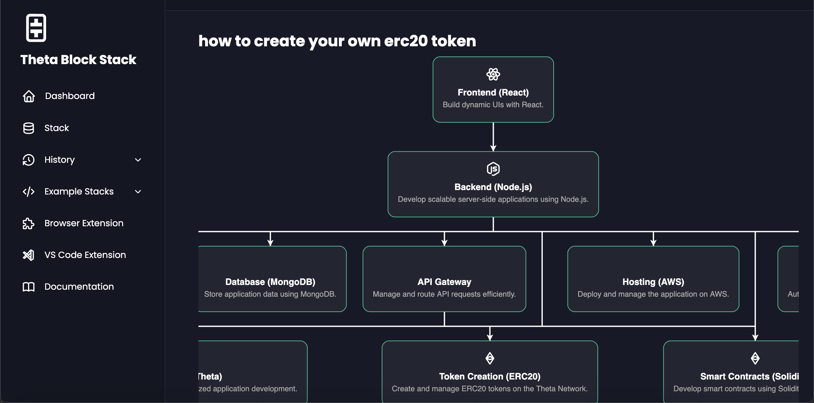

<br />
<p align="center">
  <a href="https://github.com/krvaibhaw/best-readme-template">
    
  </a>

  <h3 align="center">ThetaEdgeX</h3>

  <p align="center">
     Theta EdgeX: a comprehensive 3 in 1 tool combining idea generation, AI-driven coding, and seamless Theta network integration for developers in VS Code and Chrome.
    <br />
    <a href="https://github.com/krvaibhaw/best-readme-template"><strong>Explore the docs »</strong></a>
    <br />
    <br />
    <a href="https://github.com/krvaibhaw/best-readme-template/issues">Report Bug</a>
    ·
    <a href="https://github.com/krvaibhaw/best-readme-template/issues">Request Feature</a>
  </p>
</p>

<!-- TABLE OF CONTENTS -->

<details open="open">
  <summary>Table of Contents</summary>
  <ol>
    <li>
      <a href="#about-the-project">About The Project</a>
      <ul>
        <li><a href="#built-with">Built With</a></li>
      </ul>
    </li>
    <li><a href="#live-demo">Live Demo</a></li>
    <li>
      <a href="#getting-started">Getting Started</a>
      <ul>
        <li><a href="#prerequisites">Prerequisites</a></li>
        <li><a href="#installation">Installation</a></li>
      </ul>
    </li>
    <li><a href="#usage">Usage</a></li>
    <li><a href="#roadmap">Roadmap</a></li>
    <li><a href="#contributing">Contributing</a></li>
    <li><a href="#license">License</a></li>
    <li><a href="#contact">Contact</a></li>
    <li><a href="#acknowledgements">Acknowledgements</a></li>
  </ol>
</details>

<!-- ABOUT THE PROJECT -->

## About The Project



**ThetaEdgeX** is a comprehensive development tool designed to streamline the process of idea generation, coding, and deployment using the Theta network. By integrating AI-driven features and seamless theta edge cloud functionalities, ThetaEdgeX empowers developers to leverage the full potential of the Theta ecosystem.

### Key Features

1. **AI-Assisted Coding**:

   

   - **VS Code Extension**: Provides AI-driven code suggestions and documentation, enabling developers to efficiently write and deploy smart contracts.
   - **Natural Language Processing**: Developers can use natural language queries to find code examples and documentation, simplifying the learning curve.

2. **Theta Network Integration**:

   

   - **Chrome Extension**: Facilitates easy access to Theta Wallet, enabling users to create, import, and manage wallets, list NFTs, track account activity, and deploy contracts directly from the browser.
   - **Theta Edge Cloud**: Supports AI model deployment and inference, leveraging Theta's cloud capabilities for powerful computing tasks.

3. **AI TechStack Generator**:

   

   - **Query-Based Tech Stack Generator**: An app that accepts input queries such as "How do I build an ERC-20 token on the Theta network?" and generates a tailored tech stack and step-by-step guide on building the desired application. This feature helps developers quickly get started on projects with the right tools and frameworks.

### Problem Solved

**Accessibility and Integration**:

- Current Theta Wallet and network functionalities are only accessible via the website, limiting their integration into various applications.
- Theta EdgeX solves this by providing browser and VS Code extensions, making Theta’s capabilities easily accessible across different platforms and applications.

### Community and Ecosystem Growth

**Developer Empowerment**:

- **Theta Hackathon**: Supported by Theta Development Academy and ThetaCon, providing prizes and development advice to foster innovation.
- **Extensive Documentation**: Expands Theta's existing documentation, making it accessible to a broader audience and simplifying the development process.

### How Theta EdgeX Expands the Theta Ecosystem

- **Enhanced Accessibility**: By integrating Theta functionalities into popular tools like VS Code and Chrome, developers can easily incorporate Theta into their workflows, promoting wider adoption.
- **Community Support**: Through hackathons and academy support, Theta EdgeX fosters a strong and diverse developer community, essential for the long-term success of any technology.
- **Innovative Features**: AI-assisted coding, cloud functionalities, and the query-based tech stack generator not only streamline development but also demonstrate the advanced capabilities of the Theta network, attracting more developers and projects.

### Elevator Pitch

"Empower your development with Theta EdgeX: a groundbreaking tool integrating AI-driven coding, seamless Theta network functionalities, and a smart app generator to expand and enhance the Theta ecosystem for developers."

### Communicating to Stakeholders

1. **For Developers**: Highlight the ease of use, AI-driven features, comprehensive Theta integration, and the innovative app generator that simplifies their workflow and enhances productivity.
2. **For Investors**: Emphasize the potential for increased adoption and growth within the Theta ecosystem, driven by a strong developer community and innovative features.
3. **For the Theta Community**: Showcase how Theta EdgeX aligns with Theta’s vision by providing tools that foster innovation, support developers, and expand the ecosystem’s reach.

By focusing on these points, you can clearly communicate the purpose, benefits, and impact of Theta EdgeX on the Theta ecosystem.

A README file contains information about other files in a directory or archive of computer software. A form of documentation, it is usually a simple plain text file. There are many great README templates available on GitHub, but I think that this README template is so amazing that it'll be the last one you ever need -- I think this is it.

Here's why:

- Your time should be focused on creating something amazing. A project that solves a problem and helps others
- You shouldn't be doing the same tasks over and over like creating a README from scratch
- You should element DRY principles to the rest of your life :smile:

Of course, no one template will serve all projects since your needs may be different. So I'll be adding more in the near future. You may also suggest changes by forking this repo and creating a pull request or opening an issue. I hope this reource is helpful for you in the process of building an ultimate README page for your project.

### Built With

This section should list any major frameworks that you built your project using. Leave any add-ons/plugins for the acknowledgements section. Mention details about :

- Major languages
- Frameworks
- Technologies used

Here are a few examples.

- [Bootstrap](https://getbootstrap.com)
- [JQuery](https://jquery.com)
- [Laravel](https://laravel.com)

<!-- LIVE DEMO -->

## Live Demo

This section should list websites or platform links which live demonstrate the your project built. Leave any add-ons/plugins for the acknowledgements section.

[Live Demo Link](https://example.com)

<!-- GETTING STARTED -->

## Getting Started

This is an example of how you may give instructions on setting up your project locally.
To get a local copy up and running follow these simple example steps.

### Prerequisites

This is an example of how to list things you need to use the software and how to install them.

- requirements
  ```sh
  npm install npm@latest -g
  ```

### Installation

1. Get a free API Key at [https://example.com](https://example.com)
2. Clone the repo
   ```sh
   git clone https://github.com/your_username_/Project-Name.git
   ```
3. Install NPM packages
   ```sh
   npm install
   ```
4. Enter your API in `config.js`
   ```JS
   const API_KEY = 'ENTER YOUR API';
   ```

<!-- USAGE EXAMPLES -->

## Usage

Use this space to show useful examples of how a project can be used. Additional screenshots, code examples and demos work well in this space.
You may also link to more resources.

_For more examples, please refer to the [Documentation](https://example.com)_

<!-- ROADMAP -->

## Roadmap

See the [open issues](https://github.com/othneildrew/Best-README-Template/issues) for a list of proposed features (and known issues).

<!-- CONTRIBUTING -->

## Contributing

Contributions are what make the open source community such an amazing place to be learn, inspire, and create. Any contributions you make are **greatly appreciated**.

1. Fork the Project
2. Create your Feature Branch (`git checkout -b feature/AmazingFeature`)
3. Commit your Changes (`git commit -m 'Add some AmazingFeature'`)
4. Push to the Branch (`git push origin feature/AmazingFeature`)
5. Open a Pull Request

<!-- LICENSE -->

## License

Distributed under the MIT License. See `LICENSE` for more information.

<!-- CONTACT -->

## Contact

Your Name - [@your_twitter](https://twitter.com/your_username) - email@example.com

Project Link: [https://github.com/your_username/repo_name](https://github.com/your_username/repo_name)

<!-- ACKNOWLEDGEMENTS -->

## Acknowledgements

- [Best-README-Template](https://github.com/othneildrew/Best-README-Template)
- [Slick Carousel](https://kenwheeler.github.io/slick)
- [Smooth Scroll](https://github.com/cferdinandi/smooth-scroll)
- [Sticky Kit](http://leafo.net/sticky-kit)
- [Font Awesome](https://fontawesome.com)
